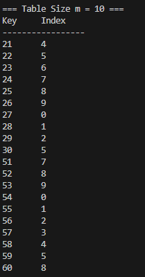
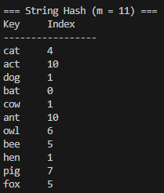

# Homework Assignment IV: Hash Function Design & Observation (C/C++ Version)

This assignment focuses on the design and observation of hash functions using C/C++. 
Students are expected to implement and analyze the behavior of hash functions, 
evaluate their efficiency, and understand their applications in computer science.

Developer: 許芷瑜  
Email: s1131456@mail.yzu.edu.tw

**Development Environment:**
- **OS:** Windows 10/11
- **Compiler:** GCC (MinGW) / G++
- **Build Tool:** `Makefile.bat`
- **Terminal:** VS Code Integrated Terminal (PowerShell)

## My Hash Function
### Integer Keys 
- Formula / pseudocode:
  ```text
  hash = 1
  p = 31 (Prime Multiplier)
  Loop: hash = (hash * p) + current_digit
  index = hash % m
  ```
- Rationale: I used a hybrid approach (`hash * 31 + digit`). This prevents zero-digits from zeroing out the result and ensures digit order matters (e.g., 12 vs 21).

### Non-integer Keys
- Formula / pseudocode:
  ```text
  Polynomial Rolling Hash (Position Weighted):
  hash = 0
  p = 31
  Loop: hash = (hash * p) + (char_value * position)
  index = hash % m
  ```
- Rationale: I implemented a variant of the **Polynomial Rolling Hash**:
  1. **Prime Multiplier (31):** Distributes keys uniformly to reduce collisions.
  2. **Position Weighting:** Adds `* position` to distinguish anagrams (e.g., "cat" vs "act").

## Experimental Setup
- Table sizes tested (m): 10, 11, 37
- Test dataset:
  - Integers: 21, 22, 23, 24, 25, 26, 27, 28, 29, 30, 51, 52, 53, 54, 55, 56, 57, 58, 59, 60
  - Strings: "cat", "act", "dog", "bat", "cow", "ant", "owl", "bee", "hen", "pig", "fox"
- **Compiler Standard:** C11 (for C) and C++17 (for C++)

### Result Snapshots
Here are the execution results captured from my environment:

**Integer Hash Output:**




**String Hash Output:**




  
### Observations
1. **Integer Hash Results:** - When **m = 10**, there is a clear pattern where numbers ending in the same digit (e.g., 21 and 51) collide. 
   - When **m = 37 (Prime)**, the pattern disappears, and the keys are distributed uniformly across the table.

2. **String Hash Results:**
   - The Polynomial Rolling Hash successfully distinguishes anagrams like **"cat"** and **"act"**, assigning them different indices.
   - Using a larger prime table size (**m = 37**) resulted in the fewest collisions compared to m = 10 or 11.

## Compilation, Build, Execution, and Output

### Compilation
- The project uses a comprehensive Makefile that builds both C and C++ versions with proper flags:
  ```bash
  # Build both C and C++ versions
  .\Makefile.bat all
  
  # Build only C version
  .\Makefile.bat c
  
  # Build only C++ version
  .\Makefile.bat cxx
  ```

### Manual Compilation (if needed)
- Command for C:
  ```bash
  gcc -std=c11 -Wall -Wextra -Wpedantic -g -o C/hash_function C/main.c C/hash_fn.c
  ```
- Command for C++:
  ```bash
  g++ -std=c++17 -Wall -Wextra -Wpedantic -g -o CXX/hash_function_cpp CXX/main.cpp CXX/hash_fn.cpp
  ```

### Clean Build Files
- Remove all compiled files:
  ```bash
  .\Makefile.bat clean
  ```

### Execution
- Run the compiled binary:
  ```bash
  .\C\hash_function.exe
  ```
  or
  ```bash
  .\C\hash_function_cpp.exe
  ```


## Analysis

- **Prime vs Non-prime `m`:** In my observation, when $m=10$ (non-prime), the hash index often correlates directly with the last digit of the key, leading to predictable collisions (e.g., 21 and 51). In contrast, using a prime number like $m=37$ effectively breaks these patterns and distributes keys uniformly across the table.

- **Patterns or Collisions:** With simple summation, strings like "cat" and "act" would collide. However, my implementation of the **Polynomial Rolling Hash** uses position weighting (`char * position`) and a prime multiplier (31). This successfully assigns unique indices to anagrams, significantly reducing collision rates compared to basic methods.

- **Improvements:** I upgraded the integer hash function from a simple multiplication (which failed on zeros) to a **hybrid approach** (`hash * 31 + digit`). This ensures that keys containing '0' (like 20 or 50) generate unique hash values instead of resetting to zero.

## Reflection

1. **Algorithm Design:** I learned that simple addition is not enough for hashing. For strings like "cat" and "act", I needed to use a **prime multiplier (31)** and **position** to make sure they have different hash values.

2. **Fixing the "Zero" Bug:** I found a problem in my first integer hash function. If a number contained '0' (like 205), simple multiplication made the result 0. I fixed this by changing the formula to mix multiplication and addition.

3. **Table Size Importance:** The assignment showed me why prime numbers are important. When I used $m=10$, many collisions happened because of the last digit. But with $m=37$, the indexes were spread out much better.

## References
1. **Choice of Multiplier (31)**: 
   - I referenced this discussion to understand why the prime number **31** is widely used in string hashing (e.g., in Java).
   - Source: [Stack Overflow - Why does Java's hashCode() in String use 31 as a multiplier?](https://stackoverflow.com/questions/299304/why-does-javas-hashcode-in-string-use-31-as-a-multiplier)
2. **Polynomial Rolling Hash Algorithm**:
   - Reference: [GeeksforGeeks - String Hashing using Polynomial Rolling Hash Function](https://www.geeksforgeeks.org/string-hashing-using-polynomial-rolling-hash-function/)
